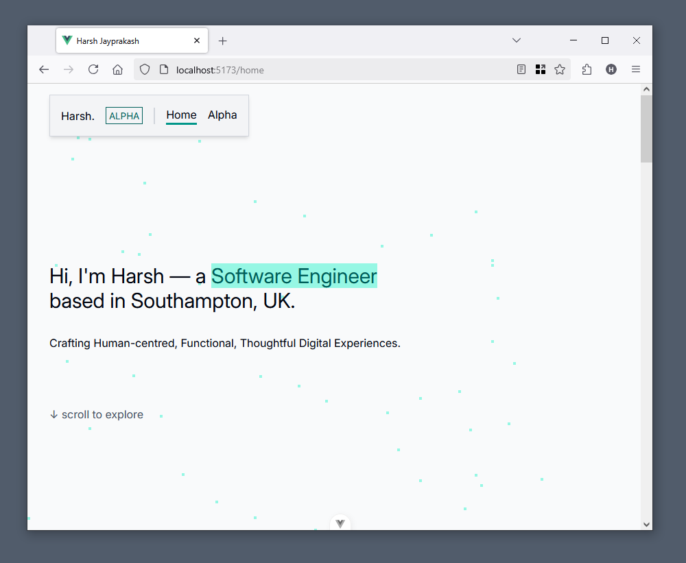

# Personal Portfolio Website

<picture>
  <source media="(prefers-color-scheme: dark)" srcset="./docs/ppw-banner-dark.png">
  <source media="(prefers-color-scheme: light)" srcset="./docs/ppw-banner-light.png">
  
</picture>

This is a personal portfolio website built with Vue.js and TypeScript. This allows me to
showcase my projects in one central place. **This website is still under construction**.

The website prioritises simplicity, accessibility, and user experience above the latest
trends. The aim was to create also a timeless digital experience that anyone will be able
to use. More details:

* Simplicity: Minimal distractions, simple typography, clean layouts.
* Accessibility: Following WCAG Guidelines (Contrast Ratios, Alt Text, ARIA Labels +
Roles)
* User Experience: Intuitive interactions, responsive design, adapts to system colour
theme (media query: prefers-color-theme).

This project intentionally minimises the reliance on dependencies, allowing for better
performance and long-term reliability.

The Inter typeface is self-hosted using the fontsource variable package to avoid the using
Google Fonts for privacy.



## Running Locally

Running the website locally is simple as a few commands after cloning the git repository.
There are no external measures to be setup.

```sh
# Install dependencies.
npm install
# Run local server.
npm run dev
```

## Changelog

* Version 5.0 --25H1F "03/05/2025"
  * Internal
    * Migrated to Composition API with Setup Tag.
    * Rewritten.
    * Mitigated Vite Vulnerabilities.
  * Improved Accessibility.
    * Add "Skip Navigation" Button.
    * Improved Colour Contrast.
  * Visual
    * Updated Colours (Zinc to Grey).
    * Redesigned Hero Section
    * Added New About Me (Merged with Skills Section).
    * Converted Skill Cards to Accordion
    * Updated Spacing
    * Updated Mobile Breakpoint
    * Added Start Year and Status to Project Cards.
    * Redesigned Contact Section.
    * Added Faded Text to Less Important Information.
    * Removed Rounded Corners.


## Limitations and Known Issues

* The `light-dark` css function is used (mdn: newly available).

## Todo

* "Back to Top" button.
* "Skip to Content" button.
* Project Filter Tablist Arrow Key Navigation.

## References

* Inter Font Family: <https://rsms.me/inter/>
* Inter on Fontsource: <https://fontsource.org/fonts/inter>
* CSS Reset: <https://www.joshwcomeau.com/css/custom-css-reset/>
* Tailwind v4.0 Colours (Grey and Teal): <https://tailwindcss.com/docs/colors>
* ARC Toolkit: <https://www.tpgi.com/arc-platform/arc-toolkit/>
