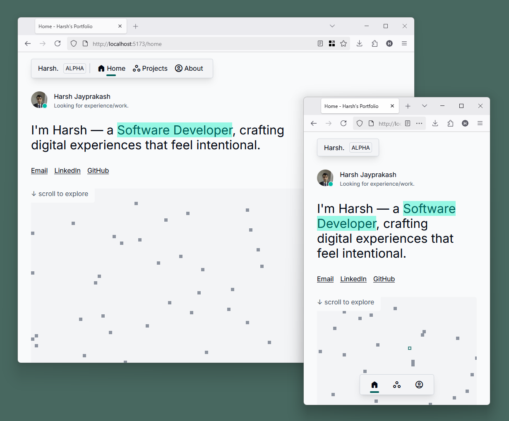

# Personal Portfolio Website

<picture>
  <source media="(prefers-color-scheme: dark)" srcset="./docs/ppw-banner-dark.png">
  <source media="(prefers-color-scheme: light)" srcset="./docs/ppw-banner-light.png">
  
</picture>

> [!NOTE]
> This website is still under construction.

## Overview

This repository contains my personal portfolio website built with Vue.js (and TypeScript).
This space allows me to share my work, thoughts and tools.

This website prioritises simplicity, accessibility, and user experience above the latest;
but also aiming to have a timeless experience that anyone can use.

* **Simplicity**: Minimal distractions and typography.
* **Accessibility**: Following WCAG Guidelines (Constrast Ratios, Alterative Text, ARIA Labels and Roles)
* **UX**: Intuitive interactions, responsive design and system-adaptive theme.

The live version of the site, <https://harshjayprakash.github.io>, corresponds to the main
branch.



## Architecture

The website follows a scalable folder structure as follows:

* `src/assets/css`: Global style sheets.
* `src/components`: Modular UI components.
* `src/composables`: Reusable logic.
* `src/data`: Static data.
* `src/layouts`: Layout components.
* `src/pages`: Page-specific components.
* `src/router`: Global router.
* `src/types`: Type definitions.

## Running Locally

Running the website locally is as simple as a few commands after cloning the git
repository. There are no external measures to be setup, expect Node.js version 18.3 or
higher.

```sh
# 1. Clone and Change Directory
git clone https://github.com/harshjayprakash/harshjayprakash.github.io.git
cd harshjayprakash.github.io

# 2. Install dependencies.
npm install

# 3. Run local server.
npm run dev
```

## Changelog

* Version 6.0
  * **Improved Navigation**:
    * Added material icons.
    * Updated underline style
    * Updated mobile style to app bar style.
  * **Dynamic Page Titles**: Updated page title for each page.
  * **Rounded Corners**: Following the rounded corners trend.
  * **Focus Styles**: Updated focus ring style.
  * **Improved Scalability**:
    * Extracted component props to interfaces.
    * Set defaults to optional props.


## Limitations and Known Issues

* The `light-dark` css function (mdn: baseline 2024, newly available).
* The `/alpha` route is not for public use.

## Todo

* [ ] Add "Back to Top" Link.
* [ ] Add arrow key navigation on tab list.
* [ ] Add project specfic pages.
* [ ] Add unit testing

## References

* Inter Font Family: <https://rsms.me/inter/>
* Inter on Fontsource: <https://fontsource.org/fonts/inter>
* CSS Reset: <https://www.joshwcomeau.com/css/custom-css-reset/>
* Tailwind v4.0 Colours (Grey and Teal, Amber 500 for Focus): <https://tailwindcss.com/docs/colors>
* ARC Toolkit: <https://www.tpgi.com/arc-platform/arc-toolkit/>
* Material Symbols Outlined on Fontsource: <https://fontsource.org/fonts/material-symbols-outlined>
* Vue Use: <https://github.com/vueuse/vueuse>
* WallpaperHub Navigation Inspiration: <https://www.wallpaperhub.app/>
* Fluent UI Component Inspiration: <https://fluent2.microsoft.design/>