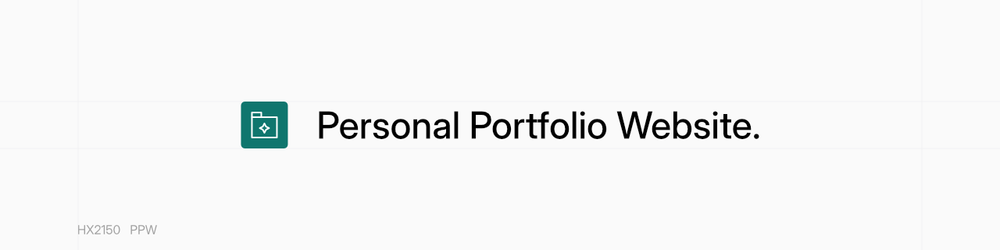
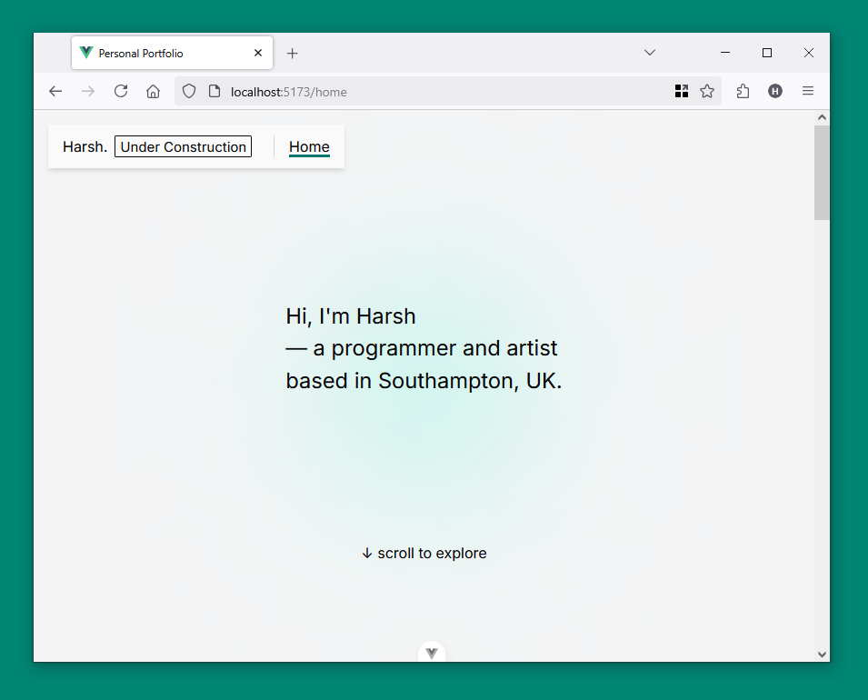

# Personal Portfolio Website



This is a personal portfolio website built with Vue.js and TypeScript. This allows me to
showcase my projects in one central place. **This website is still under construction**.



## Running Locally

Running the website locally is simple as a few commands after cloning the git repository.
There are no external measures to be setup.

```sh
# Install dependencies.
npm install
# Run local server.
npm run dev
```

## Changelog (ver 4.0-25H1D)

* Uses Custom Component System.
* Implemented Project Filter System.
* Project Cards Link to GitHub Repositories.
* Redesigned Header and Navigation.
* Updated Card Hover Effects.
* Improved Accessibility.
* Updated Colours.
* Continued migration from Options API to Composition API (_Without Setup Tag_).
* Updated for Rounded Corners Trend. (_Slightly_).

## Known Issues and Limitations

* The `/alpha` is not for public use (for development testing purposes).

## References

* Inter Font Family: <https://rsms.me/inter/>
* Inter on Fontsource: <https://fontsource.org/fonts/inter>
* CSS Reset: <https://www.joshwcomeau.com/css/custom-css-reset/>
* Tailwind v4.0 Colours (Zinc and Teal): <https://tailwindcss.com/docs/colors>
