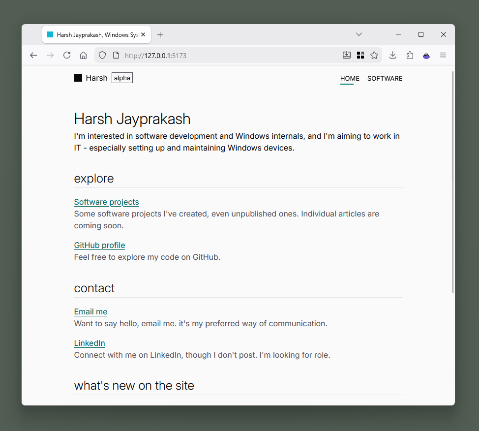

# Personal Website

> [!NOTE]
> This website is under construction.

This is a ux-first personal website providing a simple place to for my projects, notes and explorations under my control. This is without the pressure of considering this as a blog or portfolio.

I chose to write this intentionally in static HTML, CSS and minimal JS for maximum long-term reliability and not rely on a framework that could have security risks for (not) updating.

    <figure align="center">
        
        <figcaption align="center">Screenshot of personal website running in Firefox.</figcaption>
    </figure>
     

## Quick Start

The live version of the site, <https://harshjayprakash.github.io>, corresponds to the main branch.

If prefered, you may clone the repository and serve it over a local HTTP server. Note that opening the main `index.html` will not work correctly as absolute paths are used for styles and assets.

## References

- Colours (Mist, Amber, Sky): https://tailwindcss.com/docs/colors
- CSS Reset by Josh Comeau: https://www.joshwcomeau.com/css/custom-css-reset/
- Inter Font Family By RSMS: https://rsms.me/inter/
- Motif Inspired by Tsoding's Eepers: https://github.com/tsoding/eepers
- Focus State Inspired by GOV.UK: https://design-system.service.gov.uk/
- UI Inspired by Microsoft's Fleunt and Metro UIs.
- Accessibility Testing with ARC Toolkit