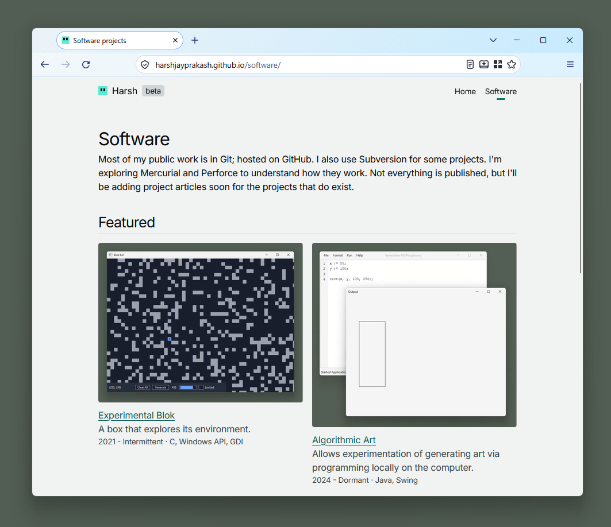

# Personal Website

A UX-first personal website providing a place to present my projects in my own way. This
is without the pressure of considering this as a blog or portfolio.

I chose to write this intentionally in static HTML and CSS for maximum long-term
reliability.

    
    
Screenshot of personal website running in Firefox.

## Quick Start

The live version of the site, <https://harshjayprakash.github.io>, corresponds to the main
branch.

If prefered, you may clone the repository and serve it over a local HTTP server. Note that
opening the main `index.html` will not work correctly as absolute paths are used for
styles and assets.

## References

- Colours (Mist, Amber): https://tailwindcss.com/docs/colors
- Custom TailwindCSS Accent (Ocean Depths): https://tailwindcolorgenerator.com/?preset=ocean-depths
- CSS Reset by Josh Comeau: https://www.joshwcomeau.com/css/custom-css-reset/
- Inter Font Family By RSMS: https://rsms.me/inter/
- Inter on Fontsource: https://fontsource.org/fonts/inter
- Motif Inspired by Tsoding's Eepers: https://github.com/tsoding/eepers
- Focus State Inspired by GOV.UK: https://design-system.service.gov.uk/
- UI Inspired by Microsoft's Fleunt and Metro UIs.
- Accessibility Testing with ARC Toolkit
